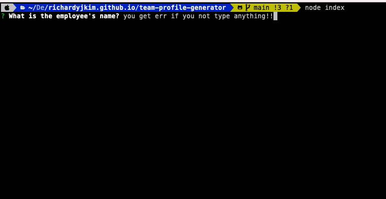
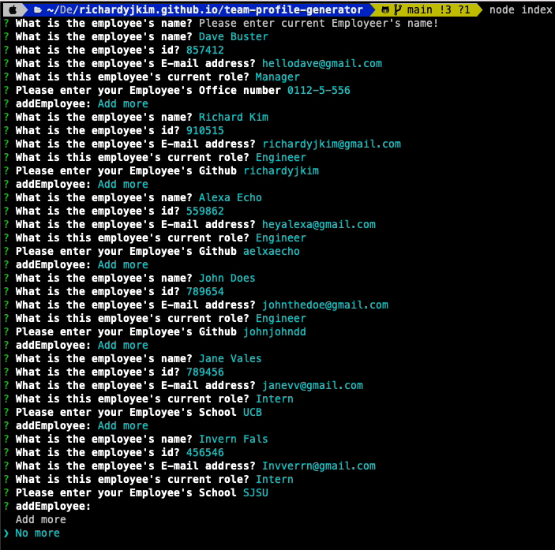
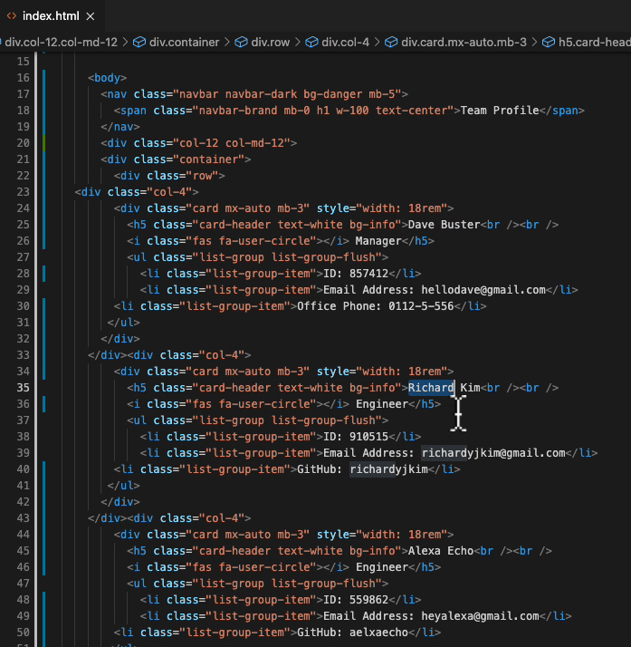
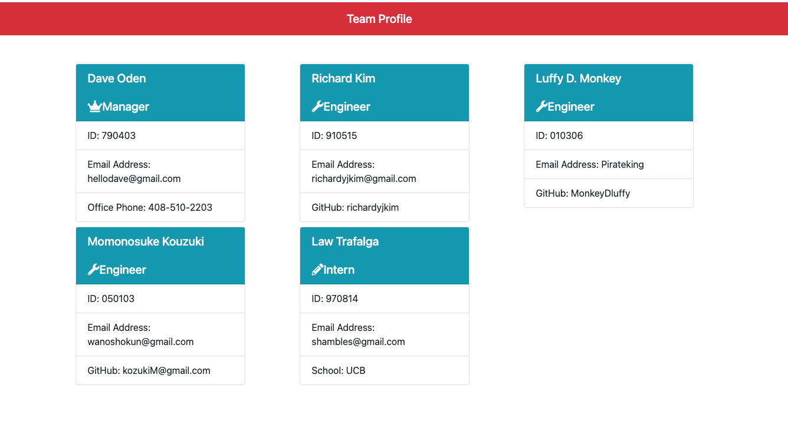

  # Readme-Generator

   
  ## Description 

  -Hello Employer, I see your team is growing. We may need your team profiles to keep track whos in your team or not. Here we have team-profile-generator to keep your team info nice and easy!

  ## Table of Contents
  
  - [Installation](#installation)
  - [Technology](#technology)
  - [Usage](#usage)
  - [Credit](#credit)
  - [License](#license)
  - [Feature](#feature)
  - [Test](#test)
  - [Questions](#questions)

  ## Installation

  - First, you need to download node to run the program, open your terminal or command line, simply type "node index" to run the program and answer the following. 

  ## Technology
  - JavaScript, ES6, Node, Jest, HTML, Boostrap

  ## Usage 

  - To generate your team profiles this may be the best of your choice!

  ## Credits

  - Richard Kim

  ## License

  - This project is cover under MIT License (https://choosealicense.com/licenses/MIT/)

  

  ## Test 
 
  - Demonstration of how to use is in the video provided 
  file located: ./src/demo-videos teamprofilegenerator.mov

   
  
  

   
  
  

  

  ## Questions
  
  - If you have any Questions, please do not hesitate to contact me one: 
  
   -Github: [richardyjkim](https://github.com/richardyjkim)
  
   -Email: richardyjkim@gmail.com
  
